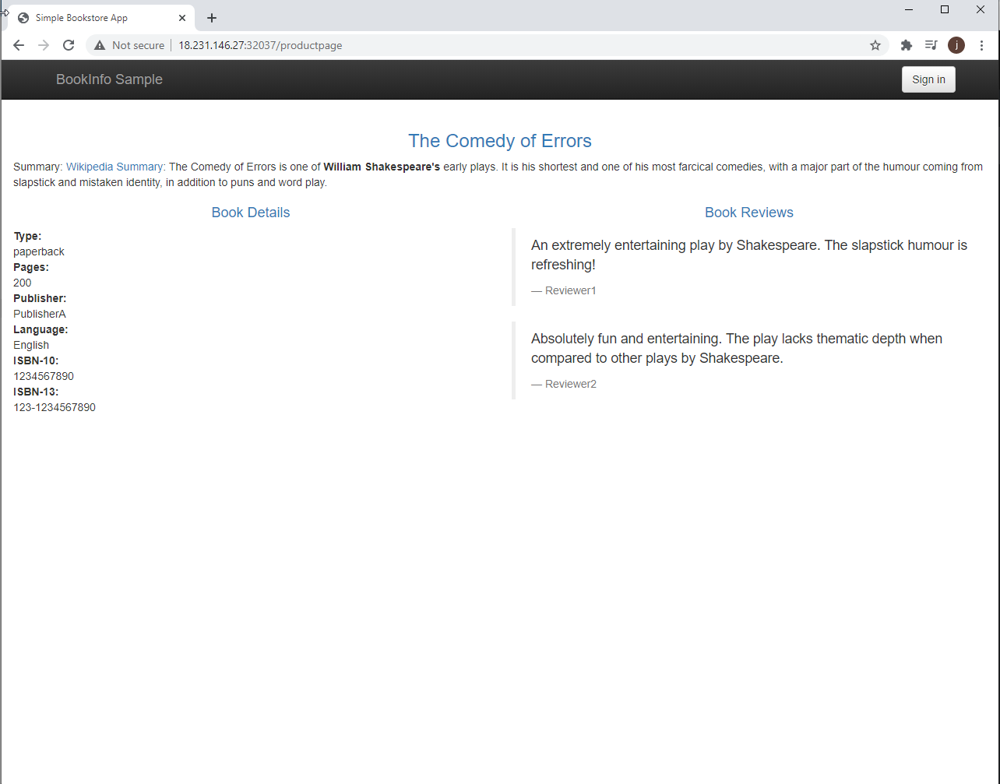
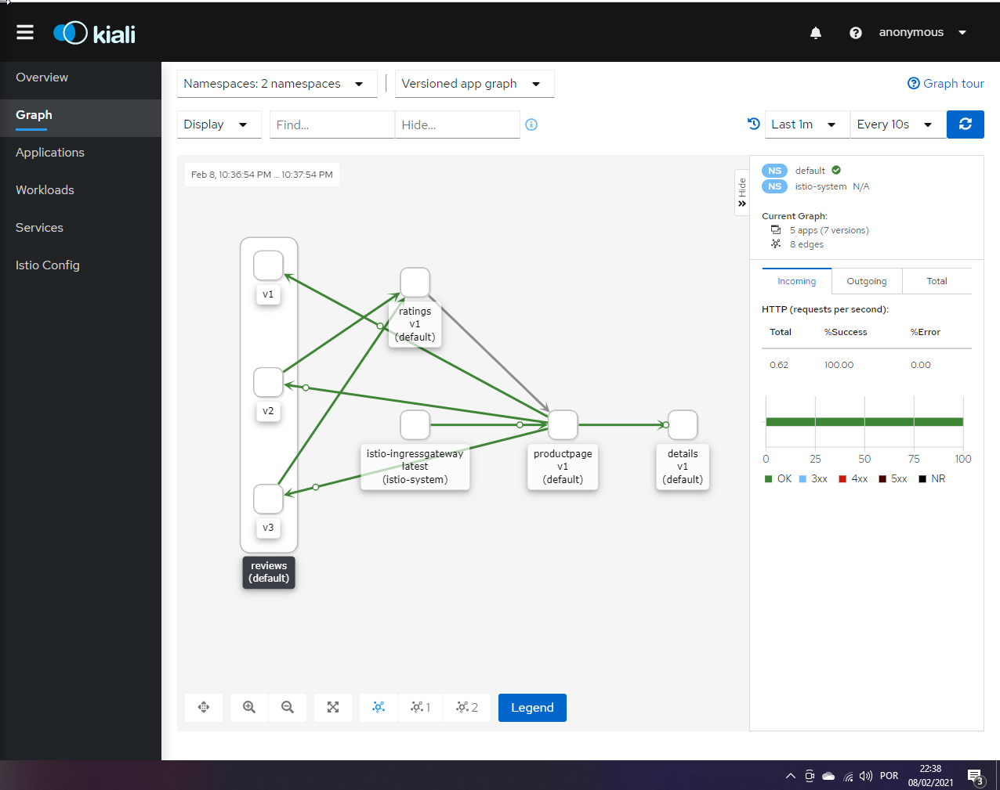

# Istio

## Links

- https://computerworld.com.br/plataformas/istio-tudo-sobre-o-projeto-open-source-do-google-para-kubernetes/ - overview sobre Istio
- https://istio.io/latest/docs/examples/bookinfo/ 
- https://learn.openshift.com/servicemesh - explicação usando openshift
- https://www.youtube.com/watch?v=Qk7FFBby43U - Tutorial como configurar o istio na aws com kubernetes, começa nos 20min
- https://www.linuxtips.io/loja - Curso pago em português
- https://istio.io/latest/docs/setup/platform-setup/ - Setup para diferentes plataformas

## O que é?

É uma ferramenta para gerenciar microserviços em termos de observability, segurança e balanceamento, sem necessidade de alterações na aplicação.

## Addons do Istio

- Prometheus: pode ser utilizado com Istio grravar metricas de rastreio da saúde do Istio e das aplicações na malha de serviço.
- Grafana: pode ser usado para monitorar a saúde do Istio e das aplicações na malha de serviço.
- Kiali: auxilia a monitorar a saúdee e entender sua estrutura de malha de serviço.
- Jaeger: auxilia no rastreio end-to-end do sistema, permitindo usuário monitorar e rastrear transações complexas de ponta a ponta. 
- Zipkin: sistema distribuido de rastreio.
- Prometheus Operator: gerencia e operar instancia de prometheus.

## Estrutura

## Configurando na AWS

https://docs.aws.amazon.com/AmazonECS/latest/developerguide/docker-basics.html
https://phoenixnap.com/kb/how-to-install-kubernetes-on-centos

kubectl apply -f "https://cloud.weave.works/k8s/net?k8s-version=$(kubectl version | base64 | tr -d '\n')"

kubectl get pods --all-namespaces

kubeadm join 172.31.43.171:6443 --token 6htcdj.4v9os5g3u4sy8e6w \
--discovery-token-ca-cert-hash sha256:662038252d1b3ce13bbe2288852bcc04350e79da90ef19b27eb92e16a6740bc5

https://istio.io/latest/docs/setup/getting-started/

kubectl get pods -n istio-system
kubectl get services -n istio-system
kubectl get svc -n istio-system | grep kiali
kubectl port-forward svc/kiali 20001:20001 -n istio-system --address 0.0.0.0

URL: http://18.231.146.27:32037/productpage - Pagina teste
URL: http://18.231.146.27:20001/kiali/

## Pagina Demo: http://18.231.146.27:32037/productpage ou http://ec2-18-231-146-27.sa-east-1.compute.amazonaws.com:32037/productpage

## Addon Kiali: http://18.231.146.27:20001/kiali/ ou http://ec2-18-231-146-27.sa-east-1.compute.amazonaws.com:20001/kiali/

